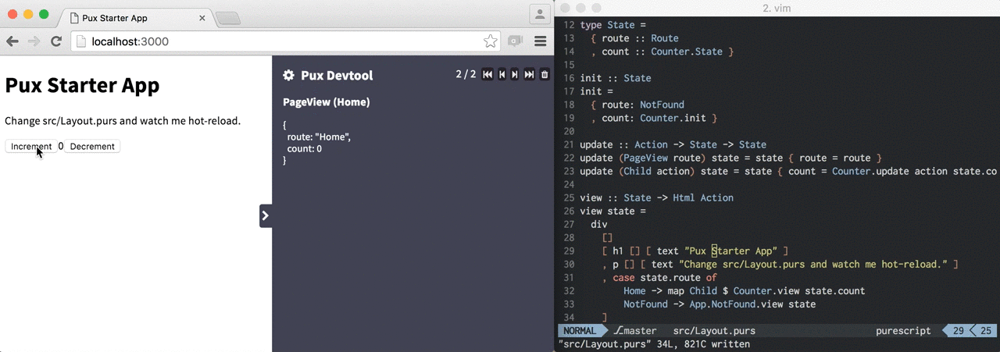

# pux-starter-app

Starter [Pux](https://github.com/alexmingoia/purescript-pux/) application using
webpack with hot-reloading and time-travel debug using
[pux-devtool](https://github.com/alexmingoia/pux-devtool).

See the [Guide](https://alexmingoia.github.io/purescript-pux) for help learning
Pux.



## Installation

```sh
git clone git://github.com/alexmingoia/pux-starter-app.git example
cd example
npm install
npm start
```

Visit `http://localhost:3000` in your browser, edit `src/purs/Layout.purs`
and watch the magic!

## Available scripts

### watch

`npm start` or `npm run watch` will start a development server, which
hot-reloads your application when sources changes.

### serve

`npm run serve` serves your application without watching for changes or
hot-reloading.

### build

`npm run build` bundles and minifies your application to run in production mode.
