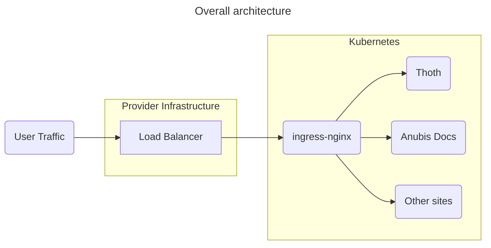

Techaro services were down for IPv4 traffic on July 9th, 2025. This blogpost is a report of what happened, what actions were taken to resolve the situation, and what actions are being done in the near future to prevent this problem. Enjoy this incident report!

<Conv name="Numa" mood="smug">
In other companies, this kind of documentation would be kept internal. At Techaro, we believe that you deserve radical candor and the truth. As such, we are proving our lofty words with actions by publishing details about how things go wrong publicly.

Everything past this point follows my standard incident root cause meeting template.

</Conv>

This incident report will focus on the services affected, timeline of what happened at which stage of the incident, where we got lucky, the root cause analysis, and what action items are being planned or taken to prevent this from happening in the future.

## Timeline

All events take place on July 9th, 2025.

| Time (UTC) | Description                                                                                                                                                                                  |
| :--------- | :------------------------------------------------------------------------------------------------------------------------------------------------------------------------------------------- |
| 12:32      | Uptime Kuma reports that another unrelated website on the same cluster was timing out.                                                                                                       |
| 12:33      | Uptime Kuma reports that Thoth's production endpoint is failing gRPC health checks.                                                                                                          |
| 12:35      | Investigation begins, [announcement made on Xe's Bluesky](https://bsky.app/profile/xeiaso.net/post/3ltjtdczpwc2x) due to the impact including their personal blog.                           |
| 12:39      | `nginx-ingress` logs on the production cluster show IPv6 traffic but an abrupt cutoff in IPv4 traffic around 12:32 UTC. Ticket is opened with the hosting provider.                          |
| 12:41      | IPv4 traffic resumes long enough for Uptime Kuma to report uptime, but then immediately fails again.                                                                                         |
| 12:46      | IPv4 traffic resumes long enough for Uptime Kuma to report uptime, but then immediately fails again. (repeat instances of this have been scrubbed, but it happened about every 5-10 minutes) |
| 12:48      | First reply from the hosting provider.                                                                                                                                                       |
| 12:57      | Reply to hosting provider, ask to reboot the load balancer.                                                                                                                                  |
| 13:00      | Incident responder because busy due to a meeting under the belief that the downtime was out of their control and that uptime monitoring software would let them know if it came back up.     |
| 13:20      | Incident responder ended meeting and went back to monitoring downtime and preparing this document.                                                                                           |
| 13:34      | IPv4 traffic starts to show up in the `ingress-nginx` logs.                                                                                                                                  |
| 13:35      | All services start to report healthy. Incident status changes to monitoring.                                                                                                                 |
| 13:48      | Incident closed.                                                                                                                                                                             |
| 14:07      | Incident re-opened. Issues seem to be manifesting as BGP issues in the upstream provider.                                                                                                    |
| 14:10      | IPv4 traffic resumes and then stops.                                                                                                                                                         |
| 14:18      | IPv4 traffic resumes again. Incident status changes to monitoring.                                                                                                                           |
| 14:40      | Incident closed.                                                                                                                                                                             |

## Services affected

| Service name                                        | User impact        |
| :-------------------------------------------------- | :----------------- |
| [Anubis Docs](https://anubis.techaro.lol) (IPv4)    | Connection timeout |
| [Anubis Docs](https://anubis.techaro.lol) (IPv6)    | None               |
| [Thoth](/docs/admin/thoth/) (IPv4)                  | Connection timeout |
| [Thoth](/docs/admin/thoth/) (IPv6)                  | None               |
| Other websites colocated on the same cluster (IPv4) | Connection timeout |
| Other websites colocated on the same cluster (IPv6) | None               |

## Root cause analysis

In simplify server management, Techaro runs a [Kubernetes](https://kubernetes.io/) cluster on [Vultr VKE](https://www.vultr.com/kubernetes/) (Vultr Kubernetes Engine). When you do this, Vultr needs to provision a [load balancer](https://docs.vultr.com/how-to-use-a-vultr-load-balancer-with-vke) to bridge the gap between the outside world and the Kubernetes world, kinda like this:

Techaro controls everything inside the Kubernetes side of that diagram. Anything else is out of our control. That load balancer is routed to the public internet via [Border Gateway Protocol (BGP)](https://en.wikipedia.org/wiki/Border_Gateway_Protocol).

If there is an interruption with the BGP sessions in the upstream provider, this can manifest as things either not working or inconsistently working. This is made more difficult by the fact that the IPv4 and IPv6 internets are technically separate networks. With this in mind, it's very possible to have IPv4 traffic fail but not IPv6 traffic.

The root cause is that the hosting provider we use for production services had flapping IPv4 BGP sessions in its Toronto region. When this happens all we can do is open a ticket and wait for it to come back up.

## Where we got lucky

The Uptime Kuma instance that caught this incident runs on an IPv4-only network. If it was dual stack, this would not have been caught as quickly.

The `ingress-nginx` logs print IP addresses of remote clients to the log feed. If this was not the case, it would be much more difficult to find this error.

## Action items

- A single instance of downtime like this is not enough reason to move providers. Moving providers because of this is thus out of scope.
- Techaro needs a status page hosted on a different cloud provider than is used for the production cluster (`TecharoHQ/TODO#6`).
- Health checks for IPv4 and IPv6 traffic need to be created (`TecharoHQ/TODO#7`).
- Remove the requirement for [Anubis to pass Thoth health checks before it can start if Thoth is enabled](https://github.com/TecharoHQ/anubis/pull/794).
