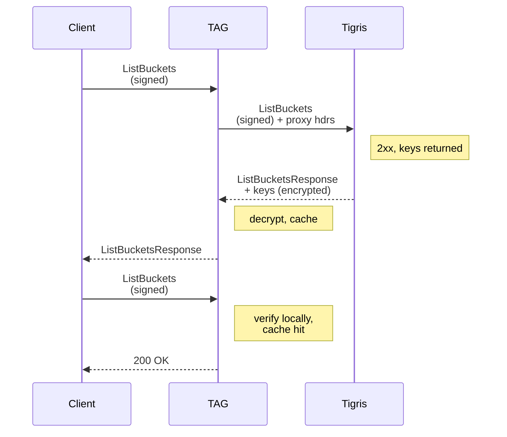

import Admonition from "../../_components/Admonition.jsx";

SigV4 looks simple: sign a request, check the signature. Then you implement
canonicalization, clock skew, and a cache that isn't allowed to hold your key.

Tigris is a drop-in replacement for AWS S3 (or GCS, anything S3API compatible).
As such, we need to be fully compatible with both the mechanisms and semantics
of S3 including the
[SigV4 authentication protocol](https://docs.aws.amazon.com/IAM/latest/UserGuide/reference_sigv.html).
This is the lingua franca of authentication in the object storage landscape;
even Google Cloud Storage has a way to enable SigV4 support so you can use
existing applications against its object storage service.

At first I thought that SigV4 was fairly simple. Clients sign requests, servers
do the same work and make sure the result matches. The main sticking point is
that the cryptography involved is symmetric cryptography, the kind where both
parties need to have the same secrets. This makes some scaling issues weird, but
we'll get into that in the future.

<Admonition type="note">
  This is only going to be talking about _authentication_ (ensuring the identity
  of a remote client), not _authorization_ (ensuring the client has the
  permission to do something).

Authorization will come in the future for reasons that will become obvious when
you see that post. We basically needed to implement a compiler. That is not a
typo.

</Admonition>

## SigV4 in a shellnut

At a high level when a client signs a request with SigV4 you get an access key
ID and secret access key. The access key ID is functionally a username and the
secret access key is functionally a password. Admins can identify keypairs by
the access key ID (without special training or tools) and services use the owner
of the access key or policies delegated to that access key to determine what
actions that client may take.

SigV4 uses
[HMAC (hash-based Message Authentication Code)](https://en.wikipedia.org/wiki/HMAC)
and
[SHA-256 (SHA-2 with a 256 bit hash width)](https://en.wikipedia.org/wiki/SHA-2)
to do authentication by creating salted hashes based on request metadata.

In order to send a SigV4 request, clients take the outgoing request, reduce it
to a canonicalized form, and sign it with a symmetric key derived from the
secret access key, the current date, region of the service, and service name,
kinda like this Go code:

```go
func HMAC(key, data []byte) []byte {
	h := hmac.New(sha256.New, key)
	h.Write(data)
	return h.Sum(nil)
}

var (
	kDate    = HMAC("AWS4"+secretAccessKey, nowDate)
	kRegion  = HMAC(kDate, region)
	kService = HMAC(kRegion, service)
	kSigning = HMAC(kService, "aws4_request")
)
```

As an example, let's see what a signed `GET` request to a
[HTTP debugging endpoint](https://github.com/Xe/x/blob/master/cmd/httpdebug/main.go)
looks like on the wire with and without the signature:

```
$ curl http://localhost:3000 -v

GET /
User-Agent: curl/8.7.1
Accept: */*
```

And when you add the signature with
[`--aws-sigv4`](https://how.wtf/aws-sigv4-requests-with-curl.html):

```
$ curl \
  --user tid_YOISC719YLXSONFU:tsec_DiYqeH8t0IKjKUKfqhzTsqrCCUl9Wm0m+6MXNhhi1fU \
  --aws-sigv4 aws:amz:auto:s3 \
  -v \
  http://localhost:3000

GET /
User-Agent: curl/8.7.1
Accept: */*
Authorization:
  AWS4-HMAC-SHA256
  Credential=tid_YOISC719YLXSONFU/20260720/auto/s3/aws4_request,
  SignedHeaders=host;x-amz-date,
  Signature=879bcdd43749cfc9782b876d9ceb3ff153d79ab1482290cca7ab915bb7f8785d
X-Amz-Date: 20260720T153748Z
```

<Admonition type="note">
  This is not a live keypair, it was specifically crafted for this post.
</Admonition>

Breaking it down we have two extra headers in the request:

- `Authorization`: The fixed string `AWS4-HMAC-SHA256` to signal to the server
  which authentication mechanism is in use. The rest of the string is
  information about the request signature so the server can properly
  canonicalize the request.
- `X-Amz-Date`: The date and time (UTC) of the request so the server knows
  _when_ the request was signed. Servers will use this request date in order to
  reject old requests to prevent
  [replay attacks](https://www.tigrisdata.com/blog/presigned-urls-security-vuln/).

### Request canonicalization and signing

On the wire, HTTP/1.1 requests look kinda like this:

```
GET /api/list?page=0&count=30
User-Agent: curl/8.7.1
Accept: */*
Host: myawesomesite.example
```

However the headers could be sent in any order, and changing the order of
request headers doesn't result in different requests. Additionally any query
string parameters could be formatted in any way a client (or server) could
imagine, including
[the use of semicolons to separate values](https://github.com/TecharoHQ/anubis/issues/1644).
All attempts to canonicalise HTTP requests _MUST_ deal with this ambiguity and
define their own rules.

SigV4 canonical requests are made up of a few parts:

- The HTTP method (`GET`, `PUT`, `POST`, `DELETE`, etc.)
- The URI path of the request (`/api/list`, etc.)
- The sorted canonical query string (you must exactly match the server-side
  canonicalization logic)
- The signed headers terminated with two newlines
- The sorted list of signed headers joined by semicolons
- The SHA256 checksum of the request body

For that example `/api/list` request, the canonical form would look like this:

```
GET
/api/list
count=30&page=0
host:myawesomesite.example
x-amz-date:20260715T204745Z

host;x-amz-date
e3b0c44298fc1c149afbf4c8996fb92427ae41e4649b934ca495991b7852b855
```

As the request has no body, the empty sha256 checksum
`e3b0c44298fc1c149afbf4c8996fb92427ae41e4649b934ca495991b7852b855` is put as the
body checksum.

<Admonition type="note">
  This exact approach requires clients and services to buffer the entire request
  body before processing it. There is a subset of SigV4 that supports
  arbitrary-sized bodies without having to buffer the entire request using
  `STREAMING-AWS4-HMAC-SHA256-PAYLOAD`, which requires extra logic that is way
  out of scope for now.

If you want to learn more, give your favourite AI agent the following prompt:

```text
I'm reading the blogpost at <link> and Xe mentioned AWS SigV4's
STREAMING-AWS4-HMAC-SHA256-PAYLOAD method. I would like to learn more about how
this works. Please research how this works and give me code and request body
samples.
```

Additionally, when you are doing presigned URL uploads in object storage, you
replace the body hash with the fixed string `UNSIGNED-PAYLOAD` when
canonicalizing because you have no way of knowing what data the client will
upload or what the SHA256 checksum will be.

</Admonition>

To make the signature, you take the sha256 checksum of the canonical request and
then HMAC it against that derived signing key:

```go
finalRequestSignature := HMAC(kSigning, reqSig.Bytes())
```

And construct the `Authorization` header based on your access key ID, service
region, and service name:

```go
req.Header.Set("Authorization", fmt.Sprintf(
	"AWS4-HMAC-SHA256 Credential=%s/%s/%s/%s/aws4_request, SignedHeaders=%s, Signature=%x",
	accessKeyID, nowDate, region, service,
	strings.Join(signedHeaders, ";"),
	finalRequestSignature,
))
```

### What about SigV4a?

AWS has made an extension to SigV4 that uses _asymmetric_ cryptography called
[SigV4a](https://docs.aws.amazon.com/IAM/latest/UserGuide/reference_sigv.html#how-sigv4a-works)
(the "a" means asymmetric). Instead of using symmetric cryptography on both the
client and server in ways that means the server needs to either know the
client's secret access key (or a value derived from the secret access key),
SigV4a uses
[key derivation functions](https://en.wikipedia.org/wiki/Key_derivation_function)
to derive a cryptographic keypair. Servers authenticating requests fetch the
public key from IAM. Only the client and IAM know what the private key is, and
that private key is what signs outgoing requests.

I'd love to use SigV4a more because it makes adding additional services to the
mix (such as [a git service](https://www.tigrisdata.com/blog/objgit/)) a lot
safer as you can have those additional services exist in different trust domains
than the core product. This is the core of how microservices end up happening.
However, it's not super widely used even within AWS. The only SigV4a use I can
find in Amazon is
[S3 Express Zones](https://aws.amazon.com/s3/storage-classes/express-one-zone/),
however they may end up using it in other services I'm just not aware of.

When I did my own experimentation with SigV4a (where I was implementing my own
IAM server so that I really understood this all at a low level), I had to copy a
lot of internal AWS SDK code into my repo in order to get it working.

I'll talk about SigV4a some more another time.

### Replay attacks and you: a young coder's illustrated primer

One of the weaknesses of using signatures for API authentication like this is
the problem of replay attacks. When you make a naïve signature of a value,
there's no real way to tell _when_ that signature was created. If you sign a
request to create a compute instance at time instance t0, it's still technically
valid at any other time instance tN. This is why the canonical form of SigV4
requests includes the current date and time:

```
Authorization: [...] SignedHeaders=host;x-amz-date, [...]
X-Amz-Date: 20260715T205432Z
```

This means that the request was signed on July 15, 2026 at 20:54:32 UTC. Time
changes constantly (at least at the rate of one second per second!) and the
client has to have a working clock in order for TLS to work. Servers can
trivially read the contents of `X-Amz-Date` and reject old requests. This means
that you don't need to add or store nonce (number used once) values with each
request because
[that doesn't scale](https://www.tigrisdata.com/blog/presigned-urls-security-vuln/#replay-attacks-are-a-real-problem-and-the-classic-fix-is-miserable).

<Admonition type="note">
  A lot of the security of this authentication protocol is predicated on TLS
  being used to encrypt the authentication headers over the wire. If TLS is not
  in use or is compromised by administrative policy, you're probably in a very
  weird exceptional situation that is very wrong in the first place. An easy
  example is an enterprise network with endpoint manglement software that does
  deep inspection of every user action.
</Admonition>

As a side effect of this, you need to set a temporal skew window for validating
requests. This window needs to be generous enough to accommodate slow clients,
sloppy timekeeping on the client side, highly latent clients,
[leap seconds](https://en.wikipedia.org/wiki/Leap_second), or other exceptional
temporal phenomena. In general time synchronization is
[a surprisingly hard problem](https://www.youtube.com/watch?v=tU0xC1ynaT8), so
it's best to just be tolerant of clients in order to make things more robust in
practice. AWS uses a temporal skew window of 15 minutes for validating requests.
I'm going to use a window of 5 minutes for my API because 300 seconds is a nice
round number and I don't have to deal with the same amount of legacy code that
AWS does.

## How TAG changes the game

So all of this SigV4 business had been working really well for Tigris. Then we
worked with a few customers who needed a local cache to fully saturate their
hungry GPUs. To be fair, Tigris is plenty fast, but the real thing that kills AI
training is latency and something that runs locally will always be faster than
the cloud.

In order to provide that sweet middle spot between making everything rely on the
cloud and having everything local, we made
[TAG](https://www.tigrisdata.com/docs/acceleration-gateway/), the Tigris
Acceleration Gateway. This effectively gives you most of a Tigris region in your
own infrastructure.

When you connect to TAG, your code uses its existing access keypairs, buckets,
and code. You point your code to TAG, you point TAG to Tigris, and then
everything is cached for you. But how does TAG authenticate with your code? TAG
doesn't have access to all your existing API keys (and to be honest it
shouldn't), but it's still able to authenticate them with SigV4 authentication.

TAG and the IAM server both implement a signing key proxying feature that lets a
client and TAG both prove their identity to Tigris. Once that proof is sent,
then TAG gets the intermediate derived signing key and uses that for locally
validating requests, kinda like this:



The
[actual implementation in TAG](https://github.com/tigrisdata/tag/blob/baca0287073290af5dbba04e5046d8b292abc3a6/proxy/forwarder_transparent.go)
involves some derived AES logic so that the derived signing keys are very much
limited to the client that requested it (namely: the AES key is the SHA256
encoded form of the proxy secret access key). One of the weird parts is that the
canonical form of the proxied requests differ from the normal SigV4
canonicalization process, namely looking like this:

```
tag.default.svc.cluster.local # Host header from the client
1784577479                    # Unix timestamp of the request (X-Tigris-Proxy-Timestamp)
GET                           # HTTP method of the client
/                             # HTTP path of the client
```

This is signed using the same SigV4 signature process as before but added
differently to the request:

- `X-Tigris-Forwarded-Host`: the HTTP Host of client requests (EG:
  tag.default.svc.cluster.local)
- `X-Tigris-Proxy-Access-Key`: the Tigris keypair used to authenticate TAG
  itself (must be in the same organization as the client)
- `X-Tigris-Proxy-Timestamp`: the time of the request in unix timestamp format
- `X-Tigris-Proxy-Signature`: the hex output of signing the canonical form of
  the request against TAG's secret access key

And then TAG reads the response from Tigris, caches those derived signing keys,
and then uses those in the standard SigV4 process to authenticate clients: no
round trip to the cloud required.

## I was wrong about the simple part

The happy path is exactly what I thought it was. Reduce a request to a canonical
form, run four HMACs, compare the result. That part fits in an afternoon.

Everything expensive lives in the questions around it. Which bytes count as the
request? Whose clock decides that a signature is still good? Who gets to hold
the key that proves any of it? Each question has an obvious answer, and each
obvious answer is wrong in some specific way you only find by implementing it.

That last question is the one that surprised me. I read symmetric cryptography
as a hard limit: if the verifier needs your secret, the verifier has to be
Tigris. It isn't. SigV4 derives its signing key through a chain of four HMACs,
each one scoped tighter than the last: date, then region, then service. Those
intermediate values can travel without the secret behind them. TAG rides that.
The key it holds stops working when the UTC date rolls over. It covers one
region and one service. You can't walk it backwards into a secret access key.

We also didn't write any of this, which is its own kind of relief. SigV4 is old,
widely deployed, and hammered on by every S3 client in existence. Any
compatibility bugs here are ours. The protocol's bugs are everyone's.

The place a protocol bends is usually some intermediate value that somebody
already designed to be thrown away.

If you want a Tigris region in your own datacentre, the
[Tigris Acceleration Gateway](https://www.tigrisdata.com/docs/acceleration-gateway/)
caches your buckets locally and authenticates your existing keypairs with the
same SigV4 dance your SDK already speaks.
